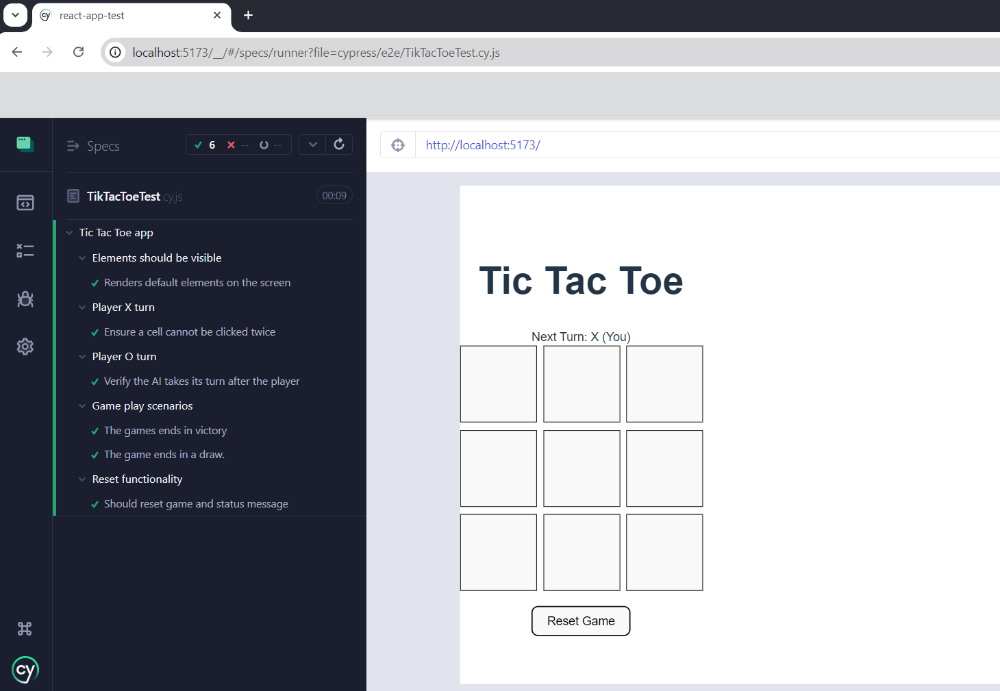

# 🤖 Tic Tac Toe with AI

This is a simple Tic Tac Toe game built with React, where a player competes against an AI opponent. Below is the detailed documentation of instructions how to use repository and key test scenarios.

## 🔍 Features:

- Play against AI: The AI plays optimally, making the game challenging.
- Winning and Tie Detection: Displays the winner or a tie at the end of the game.
- Reset Functionality: Restart the game at any time.
- Testability: Elements are tagged with `data-testid` attributes for seamless Cypress testing.

## 🪄 Installation and Setup

1. Clone the repository:
   https://github.com/viktorijabrun/React-app-tic-tac-toe-test.git
2. Install dependencies:
   `npm install`
3. Open cypress: `npm run cypress-ui` or run cypress in terminal: `npm run cypress-cli`

## 🧪 Testing Overview

The project includes End-to-End (E2E) tests written with Cypress to ensure reliable functionality.

Key Test Scenarios:

- Initial State: Verify the board loads with 9 empty cells.
- Player vs AI Gameplay:
  - Player can make moves, and the AI responds dynamically.
  - AI blocks winning moves and tries to win when possible.
- Winning Scenarios: Ensure the game detects winners correctly for both the player and AI.
- Tie Scenarios: Ensure the game detects a tie when the board is full without a winner.
- Reset Functionality: Verify the board and game state reset correctly.

## Cypress Test Execution for Tic Tac Toe Project

